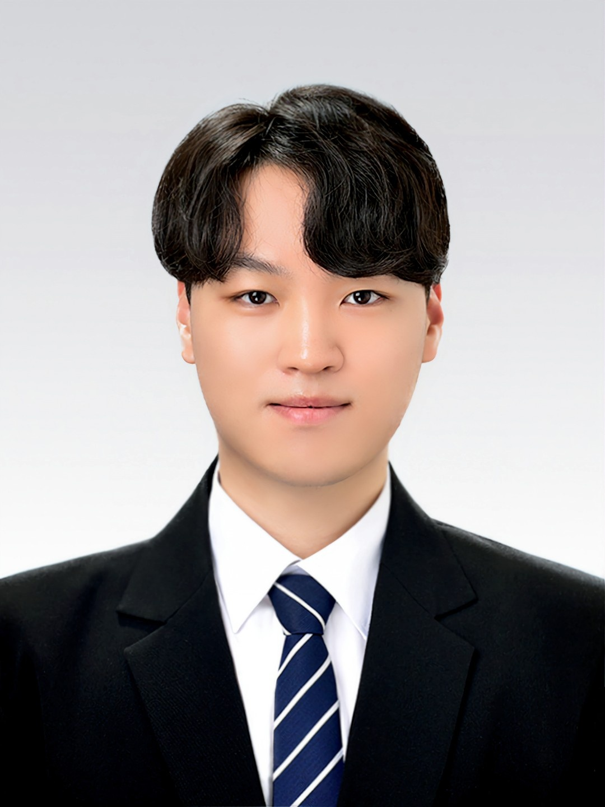

# Taehwan Yoon

---
<!--  -->

|Category |Main Thema| Sub Thema|
| --- | --- | --- |
| 🏫**scholar** | Soongsil University | MSc and PhD |
| 📬  **Mail** | dbs1045@soongsil.ac.kr | taehwanyun0@gmail.com |
| 📱**Phone** | Privacy |  |
| 🧑🏻‍💻   **Link** | Notion(ready) | [DILab](https://dilab.ssu.ac.kr/) |
| 🧑🏻‍💼**Major** | Federated Learning for privacy, Medical Analysis | FL, DL(Deep Learning), ML, Medical vision and data analysis |
| ⚽**Hobby** | 👨🏻‍💻Coding | ⛪church |

Paper Link

[Lower-Grade Glioma Segmentation in Dice-Coefficient Cross Entropy Weighted Federated Learning](https://www.dbpia.co.kr/pdf/pdfView.do?nodeId=NODE11737262)

[Stress Affect Detection At Wearable Devices Via Clustered Federated Learning](https://doi.org/10.3745/PKIPS.y2024m05a.764)

[Subnet based Federated Learning for Protecting Global Model](https://doi.org/10.3745/PKIPS.y2024m10a.701)

[Privacy Preserving Voice Phishing Detection using Federated Learning](https://doi.org/10.3745/PKIPS.y2024m10a.356)

[FedRef: Communication Efficient Bayesian Fine Tuning with Reference Model](https://arxiv.org/abs/2506.23210)

will be updated paper
    Clustered Federated Learning Based on Mahalanobis Distance for Sequential Medical Data (JIPs)

